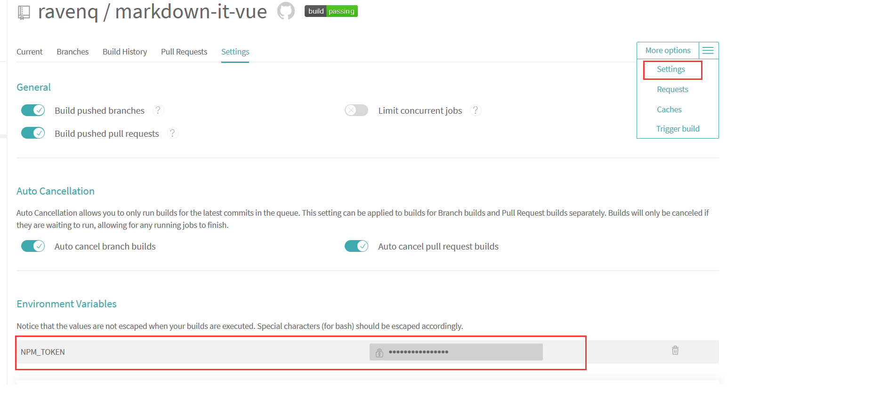

# vue-cli-plugin-component-lib

create a component lib with example for `@vue/cli` 3.0.

## Feature

* example code for your component.
* travis config if you need.

## Install

First you need to install `@vue/cli` globally (follow the instructions [here](https://cli.vuejs.org/)).

Then create a project and add the Element plugin:

```bash
vue create my-app
cd my-app
vue add component-lib
```

### Use with vue-cli UI

Skip this part if you've done everything in the `Install` section.

If you prefer managing your project in vue-cli UI (by running `vue ui`), here's how you can add component lib plugin: go to the Plugins menu, click the upper right `+ Add plugin` button, find `vue-cli-plugin-component-lib` and install it.

## Options

### travis

create ```.travis.yml``` for you project.

#### npm

depoly to npm by travis. and you may provide your email for you npm acount.

tips: you may config your travis env ```NPM_TOKEN``` first.



## Hack in your component

```sh
yarn serve
```
